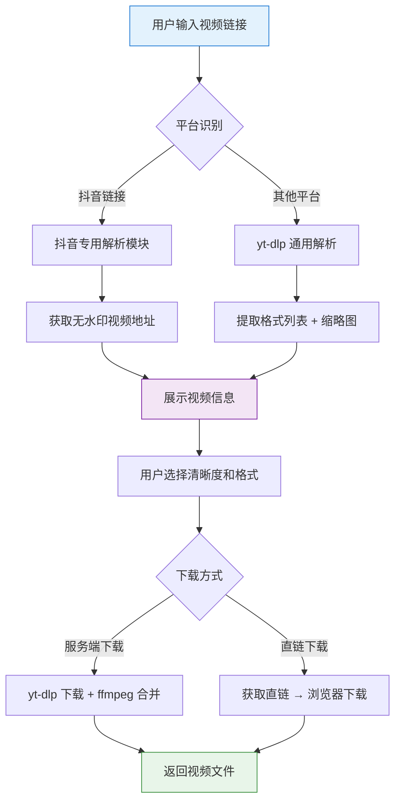
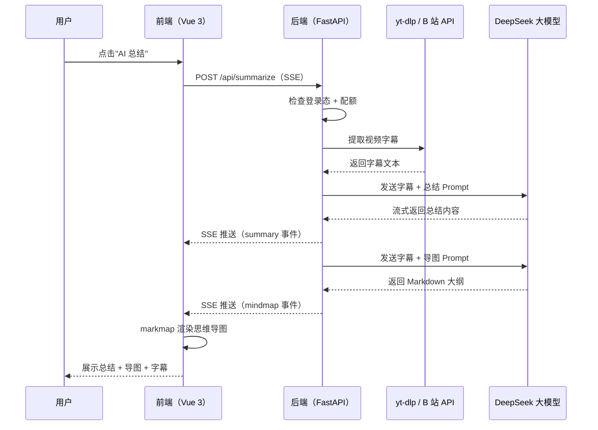

# Cursor - AI 万能视频下载总结器项目实战

这是一套以 AI 编程实战为核心的项目教程，基于 Vue 3 + FastAPI + yt-dlp + DeepSeek + Stripe，用 AI 编程的方式从 0 到 1 开发一个《AI 万能视频下载总结器》，带你亲身体验 Vibe Coding 的完整工作流，学会用 AI 快速做出一个能上线变现的实用工具！

项目代码免费开源：https://github.com/liyupi/free-video-downloader

完整视频教程 + 文字教程（预计 3 ~ 7 天学完）：https://www.codefather.cn/course/2027618983506640897

## 项目介绍

很多同学都有下载保存视频到本地的需求，比如离线观看技术教程、或者备份自己上传的作品。但很多平台要么不支持直接下载、要么限制清晰度、要么需要安装各种客户端，非常不方便。

更进一步，如果能在下载前快速了解一个长视频的核心内容，比如看一个 2 小时的技术分享，先看到 AI 总结的大纲和要点，就能判断值不值得花时间看完整视频，大幅提升学习效率。

更重要的是，这个项目不只是做一个工具，而是带大家学习一种 **利用开源项目快速解决问题** 的方法。不需要从零造轮子，站在巨人的肩膀上，用 AI 编程快速完成封装和扩展，就能快速打造出能力更强的 SaaS 平台。

这就是 AI 万能视频下载总结器的起点：输入一个视频链接，工具自动解析视频信息，支持从 B 站、YouTube、抖音等 **1800+** 平台下载视频，同时提供 **AI 视频总结**（摘要 + 思维导图 + 问答），还集成了 **用户认证** 和 **Stripe 国际支付** 能力，是一个真正能上线变现的产品。

**一个链接搞定视频下载 + AI 总结，学习效率翻倍！**

## 项目功能演示

1）多平台视频解析和下载

输入主流视频平台的视频链接，系统自动解析视频标题、封面、时长，并提供多种清晰度和格式供用户选择下载。基于 yt-dlp 开源项目，支持 **1800+** 网站，涵盖 B 站、YouTube、抖音等主流平台。针对抖音等需要特殊处理的平台，开发了专用解析模块，无需用户提供 Cookie 即可获取无水印视频。

2）AI 视频总结摘要

解析视频后，系统自动提取字幕并调用 DeepSeek 大模型进行内容分析，流式输出视频的总结摘要，Markdown 格式排版精美，帮助用户快速了解视频核心要点。

3）AI 生成思维导图

基于视频内容自动生成交互式思维导图，帮助用户一目了然地掌握视频结构。支持全屏展示、缩放拖拽查看完整内容，还可以导出高清 PNG 和 SVG 格式图片。

4）AI 视频问答

用户可以基于视频内容进行自由问答，AI 会根据字幕文本给出针对性的回答，辅助深度学习。

5）字幕导出

支持下载 SRT、VTT、TXT 等多种格式的字幕文件，方便用户自行整理和学习。

6）用户注册登录 + 会员权限

支持邮箱 + 密码注册登录，基于 JWT 实现无状态认证。免费用户每天可使用 3 次 AI 总结，VIP 会员不限次数。

7）Stripe 国际支付

集成 Stripe 国际支付平台，支持信用卡等多种支付方式，用户可一键开通 VIP 会员，解锁无限 AI 总结次数。

## 项目收获

本项目选题新颖，紧跟 AI 编程时代，以 **实用工具 + 商业变现** 为导向，区别于增删改查的烂大街项目。你不是在写代码，而是在用 AI 做一个真正有价值的工具，还能上线赚钱。

项目内容精炼，**不到一周就能学完**，快速掌握 AI 编程的核心工作流：需求分析 → 方案设计 → 编码开发 → 测试验证 → 功能扩展 → SEO/GEO 优化 → 支付集成，让你真正体验 AI 编程从开发到变现的完整闭环。

从这个项目中你可以学到：

- 如何用 AI 编程从 0 到 1 开发一个完整的前后端项目？
- 如何安装和使用 MCP、Agent Skills 增强 AI 能力？
- 如何利用开源项目实现多平台视频下载？并针对特定平台进行适配？
- 如何通过 DeepSeek 大模型实现 AI 视频总结、思维导图和问答？
- 如何使用 SSE 实现流式数据传输？
- 如何基于 JWT 实现用户认证和权限控制？
- 如何集成 Stripe 国际支付，实现收款和 Webhook 回调？
- 如何进行 SEO 和 GEO 搜索优化，让更多人看到你的产品？
- 如何利用 Cursor SubAgents 并行开发多个功能？

## 功能梳理

该项目功能丰富，涵盖视频解析下载、AI 智能总结、用户认证、会员支付、SEO/GEO 优化 5 大模块，20+ 功能点，覆盖了从工具开发、AI 应用到商业变现的完整产品闭环。

## AI 编程开发流程

这个项目遵循最主流的 AI 编程项目开发流程：

第一步，给 AI 写一段需求描述提示词，让它帮我做竞品分析和方案设计。还装了 Firecrawl MCP 抓取网页内容做竞品调研，Context7 MCP 自动拉取最新的技术文档，确保 AI 写的代码不过时。

第二步，人工确认方案。前端用 Vue 3 + Tailwind CSS，后端用 Python 的 FastAPI，视频下载核心是 yt-dlp 这个 14 万 Star 的开源项目。确认没问题后再让 AI 动手写代码。

第三步，启动开发。AI 会先规划任务列表，一步步完成前后端开发。写完还会自己打开浏览器测试。

第四步，测试验证。人工验收，发现问题再反馈给 AI 修复。

跑通核心业务流程之后，就要持续迭代优化。比如抖音视频下载需要 Cookie，用户自己获取太麻烦了，AI 自己找到了一个无需 Cookie 的抖音解析方案，直接集成进来了。还有 SSE 流式传输的时候前端 Markdown 渲染出来的内容是乱的，提示 AI 检查后端返回的数据编码方式才找到了问题根源。

后面做扩展功能的时候，还用了 SubAgents 子代理，让 AI 同时并行开发 Markdown 渲染优化、思维导图全屏展示和字幕下载三个功能，效率直接翻倍。每做完一个阶段都用 Git 提交代码，新开 AI 对话窗口的时候，把文档丢给 AI 就能快速找回记忆接着干。

建议每做完一个功能就用 Git 提交代码，防止 AI 后面改着改着搞崩了。如果上下文太长了，AI 容易断片儿，就新开一个对话窗口，把需求文档和方案文档丢给 AI，让它重新分析已有代码找回记忆。

## 核心业务流程

整个视频下载流程：用户输入链接 → 平台分流（抖音 / 通用） → 解析视频信息 → 用户选择格式和清晰度 → 服务端下载 → 返回文件。

AI 总结的核心流程：提取字幕 → 调用 DeepSeek 流式生成摘要 → 生成思维导图 → 支持问答互动。

## 技术选型

本项目以 Python 后端 + Vue 前端为核心，前后端分离，涵盖多平台视频下载、AI 大模型内容总结、SSE 流式传输、JWT 认证、Stripe 国际支付、SEO/GEO 搜索优化等实用技术，一个项目即可掌握工具类产品从开发到变现的核心技术栈。

后端：FastAPI（Python 异步 Web 框架）、yt-dlp（支持 1800+ 网站的视频下载引擎）、抖音专用解析模块（无 Cookie 方案）、DeepSeek API（AI 视频总结和问答）、SQLite、JWT（PyJWT）、bcrypt、Stripe、httpx、SSE（Server-Sent Events）

前端：Vue 3（script setup）、Vite 7、Tailwind CSS 4、Axios、Marked、markmap-lib + markmap-view（交互式思维导图）、@tailwindcss/typography

AI 编程工具：Cursor（含 Browser Use 浏览器操作）、MCP 插件（Firecrawl 网页抓取 + Context7 最新技术文档）、Agent Skills（SEO 优化）、SubAgents 子代理并行开发

## 架构设计

本项目采用前后端分离架构，前端使用 Vue 3 + Vite，后端使用 FastAPI + SQLite，通过 REST API 和 SSE 通信。后端集成 yt-dlp 实现多平台视频下载，通过 DeepSeek API 实现 AI 总结，通过 Stripe 实现支付，整体架构轻量高效。

完整视频教程 + 文字教程（预计 3 ~ 7 天学完）：https://www.codefather.cn/course/2027618983506640897

## 推荐资源

1）鱼皮 AI 导航网站：[AI 资源大全、最新 AI 资讯、免费 AI 教程](https://ai.codefather.cn)

2）编程导航学习圈：[学习路线、编程教程、实战项目、求职宝典、交流答疑](https://www.codefather.cn)

3）程序员面试八股文：[实习/校招/社招高频考点、企业真题解析](https://www.mianshiya.com)

4）程序员写简历神器：[专业模板、丰富例句、直通面试](https://www.laoyujianli.com)

5）1 对 1 模拟面试：[实习/校招/社招面试拿 Offer 必备](https://ai.mianshiya.com)
