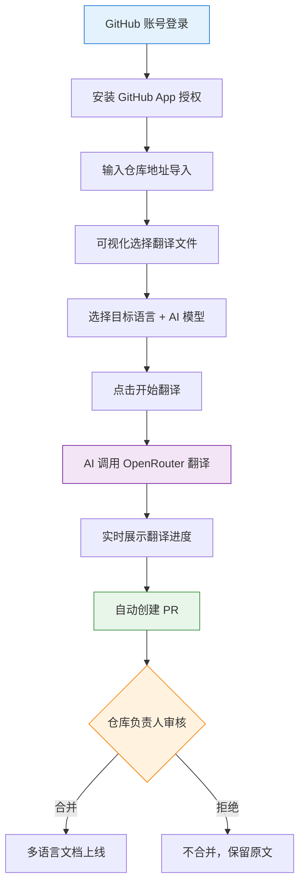

# Cursor - GitHub 文档翻译工具项目实战

这是一套以 AI 编程实战为核心的项目教程，基于 Next.js + GitHub App + OpenRouter，用 AI 编程的方式从 0 到 1 开发一个《GitHub 仓库 AI 文档翻译 SaaS 平台》，带你亲身体验 Vibe Coding 的完整工作流，学会用 AI 做出真正能用、能部署、能赚钱的产品！

项目代码免费开源：https://github.com/liyupi/github-global

完整视频教程 + 文字教程（预计 3 ~ 5 天学完）：https://www.codefather.cn/course/2014303010343092226

项目介绍视频：https://bilibili.com/video/BV1mAAmzqEfP

## 项目介绍

鱼皮开源了一套 AI 编程教程仓库 [ai-guide](https://github.com/liyupi/ai-guide)，包含了上百个中文教程文档。为了让海外用户也能看到，想把仓库翻译成多语言版本，但人工翻译成本太高，GitHub Actions 又要自己折腾配置……

既然如此，**不如做一个更通用的工具**。

这就是 GitHub Global 项目的起点：输入任意一个 GitHub 仓库地址，AI 自动将文档翻译成多种语言，并在基准语言内容发生变更时自动增量同步翻译，生成 PR 等待仓库负责人合并，全程无需人工干预。

不需要人工翻译、不需要配环境、不需要折腾什么 GitHub Actions 工作流，直接在平台上操作，轻松帮你的开源项目出海。

**零配置，一键翻译，让你的 GitHub 项目走向全球！**

## 项目功能演示

1）用 GitHub 账号一键登录

基于 GitHub App 实现安全登录与授权，比传统 OAuth App 权限更细粒度，Token 1 小时自动过期，更安全。

2）导入 GitHub 仓库

输入 GitHub 仓库地址，点击导入，平台就会自动拉取你的仓库信息，方便后续配置翻译。

3）配置翻译，灵活选择翻译范围

可以自由选择要翻译成哪些语言（支持英语、法语等 20 种主流语言），还能通过可视化的文件树勾选要翻译哪些文档。

4）一键执行翻译，自动提交 PR

点击翻译，AI 调用 OpenRouter 大模型执行翻译任务，前端实时展示进度状态：

翻译完成后自动创建 GitHub 代码合并请求，仓库负责人可以选择是否合并，既方便又安全：

5）自动触发增量翻译

开启「自动翻译」开关后，每当往仓库推送了新的文档变更，GitHub Webhook 会自动通知平台，系统只翻译「在翻译范围内且发生了变更」的文件，省时省钱：

6）自定义大模型和 API Key

平台默认提供了免费的 AI 翻译额度，也可以在设置页面配置自己的 OpenRouter API Key，从排行榜前 20 的主流大模型中自由选择翻译模型（支持 GPT、Claude、Gemini、DeepSeek 等）：

## 项目收获

本项目选题新颖，紧跟 AI 编程时代，以真实 SaaS 产品开发为导向，区别于增删改查的烂大街项目。你不是在写代码，而是在用 AI 做一个真正有价值的产品。

项目以 Vibe Coding 为核心，99% 以上的代码都是 AI 写的，主要用的是 Cursor 这款 AI 编程工具，搭配了 firecrawl-mcp 联网搜索、context7 获取最新技术文档这两个 MCP 扩展，前端页面还用了 ui-ux-pro-max 这个 Agent Skills 来生成更精美的 UI。

整个项目累积不到 1 天就做完并且上线让大家都能访问了！

从这个项目中你可以学到：

- 如何用 AI 进行需求调研，生成专业的《需求规格文档》？
- 如何用多 AI 并行的方式，同时开发前端和后端？
- 如何与 GitHub App 对接，实现安全的 OAuth 授权和仓库操作？
- 如何接入 OpenRouter，统一对接数百种 AI 大模型？
- 如何使用 GitHub API 获取仓库文件树、提交文件、创建 PR？
- 如何通过 GitHub Webhook 实现事件驱动的自动化翻译？
- 如何使用内网穿透工具，在本地调试 Webhook 回调？
- 如何用 Vercel 部署 Next.js 全栈项目，快速上线？
- 如何在 AI 开发流程中进行代码审查、版本控制和问题修复？
- 如何识别竞品差异化机会，设计真正有竞争力的产品？

## 功能梳理

该项目功能丰富，涵盖用户认证、仓库管理、翻译配置、翻译执行、变更同步 5 大模块，20+ 功能点，覆盖了真实 SaaS 产品的核心业务场景。

## AI 编程开发流程

这个项目遵循最主流的 AI 应用开发流程：

第一步，给 AI 写一段需求调研的提示词，让它联网搜索竞品、分析差异化机会，最后生成需求规格文档。

第二步，让 AI 设计技术方案，确定用 Next.js 全栈加 TypeScript、数据库用 MySQL 加 Prisma、AI 接入走 OpenRouter。

第三步最关键，开了两个 AI 窗口，一个写后端、一个写前端，后端先出接口文档给前端，两边并行开发。写完了再开一个窗口专门做测试验收和修 Bug。

跑通核心业务流程之后，就开始做各种扩展功能。建议每做完一个阶段都用 Git 提交代码，防止 AI 后面乱改把项目搞崩。为了防止上下文过多导致 AI 断片儿和浪费 Tokens，做扩展功能的时候按需开新的 AI 对话窗口，把需求文档、方案文档丢给 AI，再让它分析一下已有的项目源码，AI 就能快速找回记忆，接着干活。

最后通过 Vercel 一键部署上线，整个项目累积不到 1 天就做完并且上线了！

## 核心业务流程

用户使用流程非常简单：登录 GitHub 账号 → 导入仓库 → 配置翻译范围和语言 → 一键翻译 → 审核合并 PR，几分钟搞定。

## 技术选型

本项目以 Next.js 全栈 + TypeScript 为核心，前后端一体，综合运用了多种主流 SaaS 开发技术。

前后端：Next.js 15（App Router）、TypeScript、shadcn/ui + Tailwind CSS、Prisma ORM、MySQL、NextAuth.js

AI 相关：OpenRouter API 统一接入 100+ 大模型、AI 智能翻译、AI 分析 README 结构

GitHub 对接：GitHub App 细粒度权限控制、GitHub REST API、GitHub Webhook、Octokit

工具和部署：Ngrok 内网穿透、Vercel 一键部署、Docker 容器化、Git 版本控制

AI 编程工具：Cursor、MCP 插件（firecrawl-mcp + context7）、Agent Skills（ui-ux-pro-max）

## 架构设计

本项目采用 Next.js 全栈一体化架构，前后端合并在一套代码中，通过 API Routes 提供服务端接口，结合本地任务队列处理耗时的翻译任务，并对接 GitHub API 和 OpenRouter 完成核心业务。

完整视频教程 + 文字教程（预计 3 ~ 5 天学完）：https://www.codefather.cn/course/2014303010343092226

## 推荐资源

1）鱼皮 AI 导航网站：[AI 资源大全、最新 AI 资讯、免费 AI 教程](https://ai.codefather.cn)

2）编程导航学习圈：[学习路线、编程教程、实战项目、求职宝典、交流答疑](https://www.codefather.cn)

3）程序员面试八股文：[实习/校招/社招高频考点、企业真题解析](https://www.mianshiya.com)

4）程序员写简历神器：[专业模板、丰富例句、直通面试](https://www.laoyujianli.com)

5）1 对 1 模拟面试：[实习/校招/社招面试拿 Offer 必备](https://ai.mianshiya.com)

