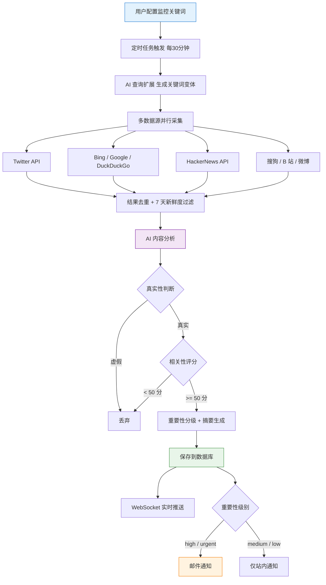

# GitHub Copilot - AI 热点监控工具项目实战

这是一套以 AI 编程实战为核心的项目教程，基于 Express 5 + React 19 + OpenRouter + Socket.io，用 AI 编程的方式从 0 到 1 开发一个《AI 热点监控工具》，带你亲身体验 Vibe Coding 的完整工作流，学会用 AI 快速做出实用的提效工具！

项目代码免费开源：https://github.com/liyupi/yupi-hot-monitor

完整视频教程 + 文字教程（预计 2 ~ 5 天学完）：https://www.codefather.cn/course/2026625439052627970

## 项目介绍

鱼皮作为 AI 编程博主，必须第一时间知道各种大模型更新、行业动态，但人工刷信息太累了，而且经常漏掉重要内容。

有了这个项目后，只需要输入要监控的关键词（比如 "Claude"、"Vibe Coding"），点击立即扫描，系统就会自动从国内外的 B 站、Bing 等 8 个以上的信息源帮你抓取相关内容。

抓回来之后，AI 会自动判断信息的真假、分析和关键词的相关性、评估重要程度，还会生成中文摘要，低质量的内容直接过滤掉，只留真正有价值的热点。

找到新热点的时候，还会通过 WebSocket 实时推送到页面上，重要的热点还会发邮件通知。如果热点太多了也没关系，可以通过筛选和排序快速定位需要的内容。

更酷的是，整个热点监控能力还被封装成了一个 Agent Skills 技能包，安装后在 Cursor、Claude Code 等各种 AI 编程工具中都能直接用，一句话就能帮你从全网搜索、分析、生成热点报告。

**让 AI 帮你盯热点，第一时间获取优质信息！**

## 项目功能演示

1）配置监控关键词

用户输入要监控的关键词，比如 "Vibe Coding"、"Claude" 等，系统会自动开始监控。支持激活 / 暂停单个关键词。

2）AI 自动抓取和分析热点

系统每 30 分钟自动从 Twitter、Bing、HackerNews、搜狗、B 站、微博等 8+ 个信息源抓取内容，利用 AI 进行查询扩展、真假识别、相关性分析和智能摘要，过滤低质量内容后展示在信息流中。

3）多维度筛选和排序

支持按信息来源、重要性、时间范围进行筛选，支持按热度综合、相关性、发布时间排序，帮助用户快速定位需要的热点信息。

4）全网搜索

除了监控关键词的实时热点流外，还可以直接搜索特定的关键词，从全网获取信息：

5）实时通知

通过 WebSocket 实时推送热点通知，高重要性的热点还会通过邮件通知：

6）Agent Skills 技能包

将热点监控能力封装为标准的 Agent Skills，安装后在 Cursor、VSCode Copilot、Claude Code 等 AI 编程工具中都能使用：

## 项目收获

本项目选题新颖，紧跟 AI 编程时代，以实用工具开发为导向，区别于增删改查的烂大街项目。你不是在写代码，而是在用 AI 做一个真正有价值的工具。

项目以 Vibe Coding 为核心，99% 以上的代码都是 AI 写的，主要用的是 VSCode + GitHub Copilot 作为 AI 编程工具，搭配了 Firecrawl MCP 做网页抓取、Context7 MCP 获取最新技术文档，前端页面还用了 UI UX Pro Max 这个 Agent Skills 来美化，配合 Aceternity UI 组件库做出了充满科技感的炫酷界面。

从这个项目中你可以学到：

- 如何用 AI 编程从 0 到 1 开发一个完整的工具？
- 如何安装和使用 MCP 增强 AI 能力？
- 如何安装和使用 Agent Skills 提升 AI 编程质量？
- 如何从多个信息源（Twitter、Bing、HN、B 站等）聚合抓取内容？
- 如何通过 OpenRouter 接入 AI 大模型，实现智能内容审核？
- 如何实现查询扩展（Query Expansion），提高信息检索的召回率？
- 如何基于 Socket.io 实现 WebSocket 实时推送？
- 如何使用 Aceternity UI 打造炫酷的科技感前端界面？
- 如何开发标准化的 Agent Skills 技能包，并在多种 AI 工具中验证？
- 如何在 AI 编程中进行人工确认、版本控制和迭代优化？

## 功能梳理

该项目功能丰富，涵盖关键词管理、热点采集和分析、信息展示和筛选、实时通知系统、全网信息源搜索、Agent Skills 六大模块，20+ 功能点，覆盖了从信息采集、AI 智能分析到实时推送通知的完整热点监控闭环。

## AI 编程开发流程

这个项目遵循最主流的 AI 编程项目开发流程：

第一步，给 AI 写一段需求描述提示词，让它帮我设计方案。当然，如果你有自己的想法，可以适当发挥一点儿专业性，比如要利用 OpenRouter 来对接 AI 服务。

第二步，人工确认方案。包括前端、后端、数据存储技术栈，抓取热点数据的范围和方法，发送通知的方法，热点检查频率等，确认没问题后再让 AI 动手写代码。

第三步，启动开发。AI 会先规划任务列表，一步步完成前后端开发。

第四步，测试验证。在环境变量文件中配置 API 密钥等信息，然后启动项目点点点~

跑通核心业务流程之后，就要持续迭代优化。比如先是增加了多个信息来源，能获取到更多国内外的信息。然后发现获取的信息不准确，就设计了多层级过滤机制，并且让 AI 加了查询扩展。前端界面也从千篇一律的蓝紫色优化成了有流星、光影效果的科技感页面。

建议每做完一个功能就用 Git 提交代码，防止 AI 后面改着改着搞崩了。如果上下文太长了，AI 容易断片儿，就新开一个对话窗口，把需求文档和方案文档丢给 AI，让它重新分析已有代码找回记忆。

## 核心业务流程

整个项目的核心流程：用户配置关键词 → 定时任务触发 → AI 查询扩展 → 多源抓取 → 去重过滤 → AI 分析 → 入库 → 实时推送 / 邮件通知。

## 技术选型

本项目以 Node.js 全栈 + TypeScript 为核心，前后端分离，涵盖多源爬虫数据采集、AI 大模型内容审核、WebSocket 实时推送、定时任务调度、Aceternity UI 科技感前端、Agent Skills 开发等实用技术。

后端：Express 5、TypeScript、Prisma ORM、SQLite、Socket.io、node-cron、Nodemailer

前端：React 19、Vite 7、Tailwind CSS 4、Framer Motion、Aceternity UI 组件、Socket.io-client

数据采集：Axios + Cheerio 爬虫、TwitterAPI.io、HackerNews API、B 站公开 API

AI 相关：OpenRouter API 统一接入多种大模型、AI 内容审核、Query Expansion 查询扩展

AI 编程工具：VSCode + GitHub Copilot、MCP 插件（Firecrawl + Context7）、Agent Skills（UI UX Pro Max + Skill Creator）

## 架构设计

本项目采用前后端分离架构，前端使用 React + Vite，后端使用 Express + Prisma，通过 REST API 和 WebSocket 通信。通过定时任务引擎来驱动多数据源采集和 AI 分析，Agent Skills 作为独立模块可在多种 AI 编程工具中复用。

完整视频教程 + 文字教程（预计 2 ~ 5 天学完）：https://www.codefather.cn/course/2026625439052627970

## 推荐资源

1）鱼皮 AI 导航网站：[AI 资源大全、最新 AI 资讯、免费 AI 教程](https://ai.codefather.cn)

2）编程导航学习圈：[学习路线、编程教程、实战项目、求职宝典、交流答疑](https://www.codefather.cn)

3）程序员面试八股文：[实习/校招/社招高频考点、企业真题解析](https://www.mianshiya.com)

4）程序员写简历神器：[专业模板、丰富例句、直通面试](https://www.laoyujianli.com)

5）1 对 1 模拟面试：[实习/校招/社招面试拿 Offer 必备](https://ai.mianshiya.com)
