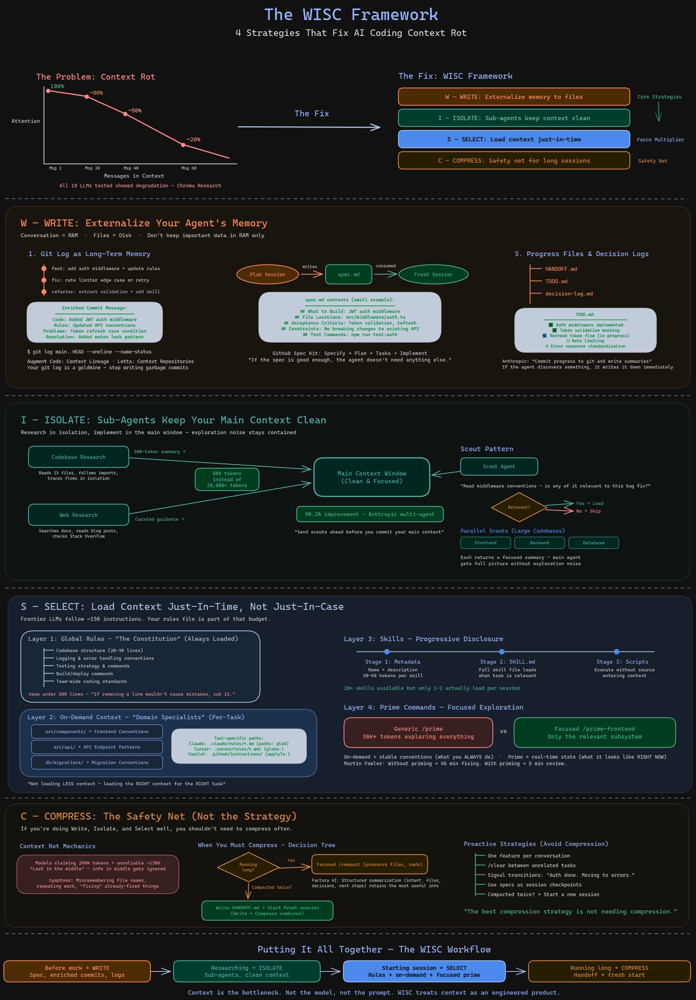

# WISC Framework: Context Engineering for AI Coding



## What is WISC?

WISC is a practical framework for managing AI context in coding sessions, based on [Anthropic's four context engineering strategies](https://www.anthropic.com/engineering/effective-context-engineering-for-ai-agents). The acronym stands for:

- **W - Write**: Externalize your agent's memory to files so it survives context resets
- **I - Isolate**: Use sub-agents to keep research noise out of your main session
- **S - Select**: Load only the context you need for the current task, not everything
- **C - Compress**: When sessions run long, compress with focus or hand off to a fresh session

The ordering is intentional — Write and Isolate have the most impact, Select is the force multiplier, and Compress is the safety net.

## The 3-Tier Context System

This use case demonstrates a progressive disclosure approach to AI context, built for Claude Code but applicable to any AI coding tool:

### Tier 1: Global Rules (`CLAUDE.md`)

Always loaded. Covers project structure, essential commands, architecture overview, and universal conventions. Keep this lean — under 500 lines. If removing a line wouldn't cause the AI to make mistakes, cut it.

### Tier 2: On-Demand Rules (`.claude/rules/`)

Loaded automatically based on which files the agent is working with. Each rule file has a `paths:` frontmatter that triggers auto-loading — for example, `testing.md` loads when the agent touches `**/*.test.ts`, and `web-frontend.md` loads when working in `packages/web/**/*.tsx`.

**Examples in `.claude/rules-example/`:**

| File | Auto-loads when touching | What it covers |
|------|--------------------------|----------------|
| `testing.md` | `**/*.test.ts` | Mock isolation rules, test batching, lazy logger patterns |
| `web-frontend.md` | `packages/web/**/*.tsx` | Tailwind v4, SSE event types, React Router v7 |
| `database.md` | `**/db/**` | Query patterns, migration conventions, dual DB support |
| `orchestrator.md` | `**/orchestrator/**` | Session lifecycle, routing agent, streaming |
| `workflows.md` | `**/workflows/**` | YAML parsing, execution modes, variable substitution |
| `adapters.md` | `**/adapters/**` | Platform adapter patterns, auth, message formatting |
| `isolation.md` | `**/isolation/**` | Worktree provider, error classification, environment lifecycle |
| `server-api.md` | `**/server/**`, `**/routes/**` | API routes, SSE streaming, webhook verification |
| `cli.md` | `**/cli/**` | CLI adapter, command registration, output formatting |

### Tier 3: Reference Docs (`.claude/docs/`)

Heavy reference guides designed for sub-agent scouting. These are NOT auto-loaded. Instead, a sub-agent reads the header to determine relevance, then loads the full doc only if needed. This keeps 1,000+ lines of deep reference out of your main context.

**Examples in `.claude/docs-example/`:**

| File | Lines | What it covers |
|------|-------|----------------|
| `architecture-deep-dive.md` | 324 | Full system architecture, data flow, package dependencies |
| `workflow-yaml-reference.md` | 309 | Complete YAML syntax for steps, loops, DAGs, variables |
| `adapter-implementation-guide.md` | 248 | How to build a new platform adapter end-to-end |
| `isolation-and-worktree-guide.md` | 231 | Git worktree mechanics, environment lifecycle, error handling |

## Slash Commands

These implement WISC strategies as reusable slash commands in Claude Code (`.claude/commands/`):

### Prime Commands (Select)

Load focused codebase context at the start of a session. Instead of exploring the entire codebase (~30K+ tokens), each prime variant explores only the relevant subsystem.

| Command | What it primes |
|---------|----------------|
| `/prime` | Full codebase overview (all packages) |
| `/prime-backend` | Core business logic + HTTP server |
| `/prime-frontend` | React UI, SSE hooks, components |
| `/prime-workflows` | Workflow engine (loader, router, executor, DAG) |
| `/prime-isolation` | Git worktree isolation system |

### Planning & Execution (Write)

| Command | What it does |
|---------|-------------|
| `/plan-feature` | Spawns sub-agents to research the codebase, then writes a detailed implementation plan to a file. The plan becomes the spec for a fresh implementation session. |
| `/execute` | Reads a plan file and implements it step-by-step. Runs in a fresh session with only the plan as context — no planning conversation baggage. |

### Session Management (Write + Compress)

| Command | What it does |
|---------|-------------|
| `/handoff` | Gathers git state, writes a `HANDOFF.md` with completed work, key decisions, dead ends, and recommended next action. The next session reads this file and picks up immediately. |
| `/commit` | Creates an enriched commit with conventional tags, a WHY-focused body, and a `Context:` section that logs changes to rules, commands, or docs alongside code changes. |

## How the Strategies Map to Commands

```
WRITE       /plan-feature  /execute  /handoff  /commit
             (specs)        (specs)   (progress) (git memory)

ISOLATE     /plan-feature spawns research sub-agents
            /prime-* commands use focused exploration
            Scout pattern: sub-agents read docs headers first

SELECT      /prime-*       .claude/rules/*.md    .claude/docs/*.md
            (focused)      (auto-loaded)          (on-demand via scouts)

COMPRESS    /handoff       /compact (built-in)
            (write+compress) (focused compaction)
```

## Applying This to Your Project

1. **Start with Write** — Set up enriched commits and spec-driven planning. This alone transforms your AI coding workflow.
2. **Add Select** — Move domain-specific conventions out of your global rules into path-scoped rule files. Keep your `CLAUDE.md` lean.
3. **Use Isolate** — When researching, spawn sub-agents instead of reading files in your main session. The exploration noise stays contained.
4. **Compress as needed** — Use focused `/compact` with explicit preservation targets, or write a `/handoff` and start fresh.

## Resources

- [Anthropic: Context Engineering for AI Agents](https://www.anthropic.com/engineering/effective-context-engineering-for-ai-agents)
- [Anthropic: Effective Harnesses for Long-Running Agents](https://www.anthropic.com/engineering/effective-harnesses-for-long-running-agents)
- [Martin Fowler: Knowledge Priming for AI Agents](https://martinfowler.com/articles/reduce-friction-ai/knowledge-priming.html)
- [Progressive Disclosure for AI Coding Tools](https://alexop.dev/posts/stop-bloating-your-claude-md-progressive-disclosure-ai-coding-tools/)
- [Context Rot Research (Chroma)](https://research.trychroma.com/context-rot)
- [GitHub Spec Kit](https://github.com/github/spec-kit)
